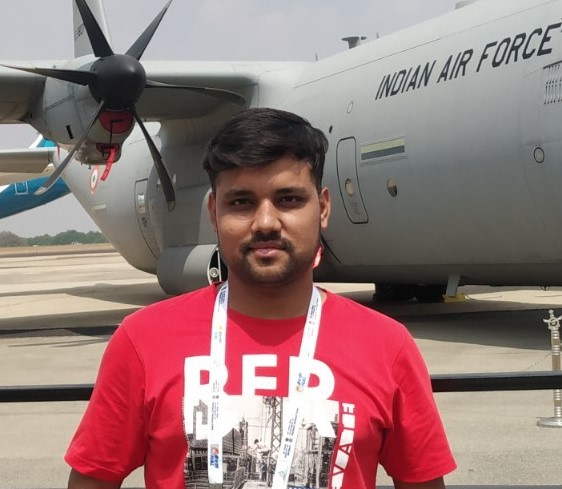

# Sourav Sinha
{:height="360px" width="360px"}
>
> Aerospace Engineer (Control Theory, Unmanned Aerial Systems)  \
> **Current**: Ph.D. Candidate and GRA @ Virginia Tech  \
> **Previous**: IIT Kanpur


[Google Scholar profile](https://scholar.google.co.in/citations?user=lNqewX0AAAAJ&hl=en&inst=13410158990364976897){:target="_blank" rel="noopener"}.   
[ResearchGate profile](https://www.researchgate.net/profile/Sourav-Sinha-8){:target="_blank" rel="noopener"}


## Education
#### Virginia Tech, *Blacksburg, US,* 2019-2023 (tentative)
>
> Ph.D. in Aerospace Engineering \
> GPA: 4.0/4.0 \
> Advisor: [Dr. Mazen Farhood](http://www.dept.aoe.vt.edu/~farhood/Main.html){:target="_blank" rel="noopener"}

#### IIT Kanpur, *Kanpur, India,* 2014-2019
>
> Integrated B.Tech.-M.Tech. in Aerospace Engineering  \
> GPA: 8.2/10.0 (B.Tech), 9.33/10.0 (M.Tech) \
> Advisors: [Dr. Abhishek](https://home.iitk.ac.in/~abhish/){:target="_blank" rel="noopener"} and [Dr. Mangal Kothari](https://home.iitk.ac.in/~mangal/){:target="_blank" rel="noopener"}

## Projects
### 1. LPV/LFT Representation of Nonlinear Systems
```markdown
in progress
```
### 2. IEMI-based Actuator Attacks 
```markdown
in progress
```
### 3. Robust H-Infinity Control of UASs 
```markdown
in progress
```
### 4. IEMI-based Actuator Attacks 
```markdown
in progress
```
### 5. Critical Attack Points in Cyber Physical Systems 
```markdown
in progress
```

## Skills

## Courses
>
> Dynamics and Controls
> > Linear Systems Theory, Nonlinear Systems Theory, Vehicle Dynamics and Control, Linear Control Theory
> > Autonomous Navigation, Missile Guidance and Dynamics, Control System Analysis, Basics of Modern Control Design, Flight Mechanics

> Machine Learning
> > Deep Learning, Convex Optimization, Computer Vision

> Aircraft
> > Aircraft Design, Helicopter Theory, Preliminary Design of Helicopter, Autononmous Unmanned Aerial Systems, Aeromodel Design and Fabrication


## Contact
[Email](mailto:srvsinha@vt.edu){:target="_blank" rel="noopener"} | [Linkedin](https://www.linkedin.com/in/sourav-sinha-7a8380b8/){:target="_blank" rel="noopener"} | [Instagram](https://www.instagram.com/srvsinha186/){:target="_blank" rel="noopener"} | [Facebook](https://www.facebook.com/srvgr8/){:target="_blank" rel="noopener"}
