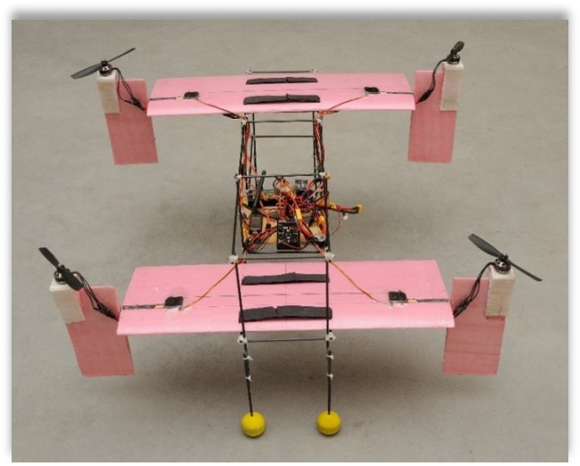

# Sourav Sinha
{:height="180px" width="180px"}
>
> Aerospace Engineer (Control Theory, Unmanned Aerial Systems)  \
> **Current**: Ph.D. Candidate and GRA @ Virginia Tech  \
> **Previous**: IIT Kanpur

[Google Scholar profile](https://scholar.google.co.in/citations?user=lNqewX0AAAAJ&hl=en&inst=13410158990364976897){:target="_blank" rel="noopener"}  
[ResearchGate profile](https://www.researchgate.net/profile/Sourav-Sinha-8){:target="_blank" rel="noopener"}

## Education
#### Virginia Tech, *Blacksburg, US,* 2019-2023 (tentative)
>
> Ph.D. in Aerospace Engineering \
> GPA: 4.0/4.0 \
> Advisor: [Dr. Mazen Farhood](http://www.dept.aoe.vt.edu/~farhood/Main.html){:target="_blank" rel="noopener"}

#### IIT Kanpur, *Kanpur, India,* 2014-2019
>
> Integrated B.Tech.-M.Tech. in Aerospace Engineering  \
> GPA: 8.2/10.0 (B.Tech), 9.33/10.0 (M.Tech) \
> Advisors: [Dr. Abhishek](https://home.iitk.ac.in/~abhish/){:target="_blank" rel="noopener"} and [Dr. Mangal Kothari](https://home.iitk.ac.in/~mangal/){:target="_blank" rel="noopener"}

## Projects

### 1. LPV/LFT Representation of Nonlinear Systems
**Publication**: **S. Sinha**, D. Muniraj, and M. Farhood, “LFT Representation of a Class of Nonlinear Systems: A Data-Driven 
Approach,” *European Control Conference*, 2021. [[link]](https://ieeexplore.ieee.org/abstract/document/9655026) 

### 2. IEMI-based Actuator Attacks 
**Publication**: G.Y. Dayanikli, **S. Sinha**, D. Muniraj, R.M. Gerdes, M. Farhood, and M. Mina,  “Physical-Layer Attacks Against
Pulse Width Modulation-Controlled Actuators,” *USENIX Security Symposium*, 2022. [[link]](https://www.usenix.org/conference/usenixsecurity22/presentation/dayanikli)

### 3. Robust H-Infinity Control of UAS 
in progress

### 4. Critical Attack Points in Cyber Physical Systems 
in progress

### 5. Adversarial Attacks on Object Tracking
in progress

### 6. Development of a Novel Quadrotor Convertiplane UAS
{:width="100px"} 

**Publication 1**: **S. Sinha**, N. Raj, A. Abhishek, and M. Kothari, “Flight dynamic modeling and control of a novel quadrotor convertiplane
UAV,” *Vertical Flight Society Annual Forum*, 2018. [[link]](https://vtol.org/store/product/flight-dynamic-modeling-and-control-of-a-novel-quadrotor-convertiplane-unmanned-aerial-vehicle-12923.cfm)

**Publication 2**: A. Abhishek, M. Krishna, **S. Sinha**, J. Bhowmik, and D.  Das, “Design, development and flight testing of a novel 
quadrotor convertiplane unmanned air vehicle,” *Vertical Flight Society Annual Forum*, 2017. [[link]](https://www.researchgate.net/profile/Abhishek-Abhishek/publication/317380270_Design_Development_and_Flight_Testing_of_a_Novel_Quadrotor_Convertiplane_Unmanned_Air_Vehicle/links/5937c39faca272ede1cf7d1f/Design-Development-and-Flight-Testing-of-a-Novel-Quadrotor-Convertiplane-Unmanned-Air-Vehicle.pdf)

## Skills

## Courses
>
> Dynamics and Controls
> > Linear Systems Theory, Nonlinear Systems Theory, Vehicle Dynamics and Control, Linear Control Theory
> > Autonomous Navigation, Missile Guidance and Dynamics, Control System Analysis, Basics of Modern Control Design, Flight Mechanics

> Machine Learning
> > Deep Learning, Convex Optimization, Computer Vision

> Aircraft
> > Aircraft Design, Helicopter Theory, Preliminary Design of Helicopter, Autononmous Unmanned Aerial Systems, Aeromodel Design and Fabrication

## Contact
[Email](mailto:srvsinha@vt.edu){:target="_blank" rel="noopener"} | [Linkedin](https://www.linkedin.com/in/sourav-sinha-7a8380b8/){:target="_blank" rel="noopener"} | [Instagram](https://www.instagram.com/srvsinha186/){:target="_blank" rel="noopener"} | [Facebook](https://www.facebook.com/srvgr8/){:target="_blank" rel="noopener"}
