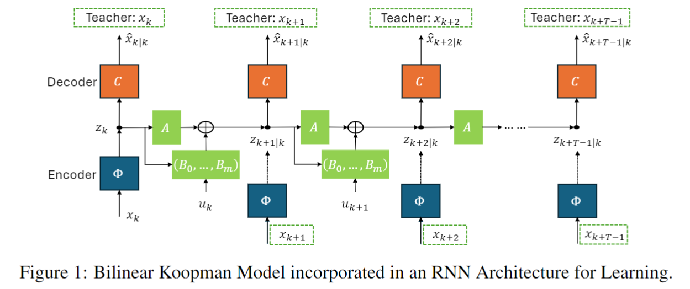
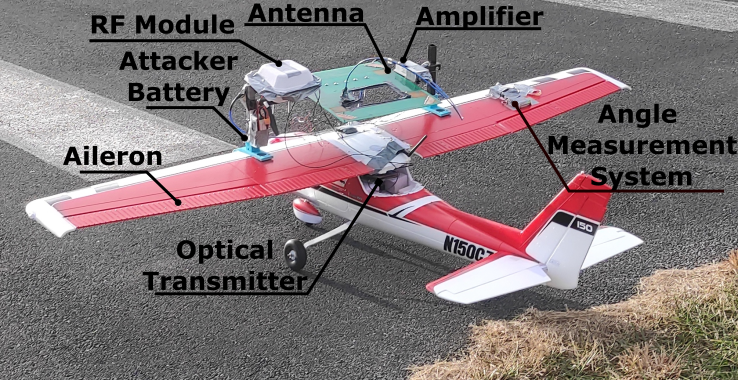
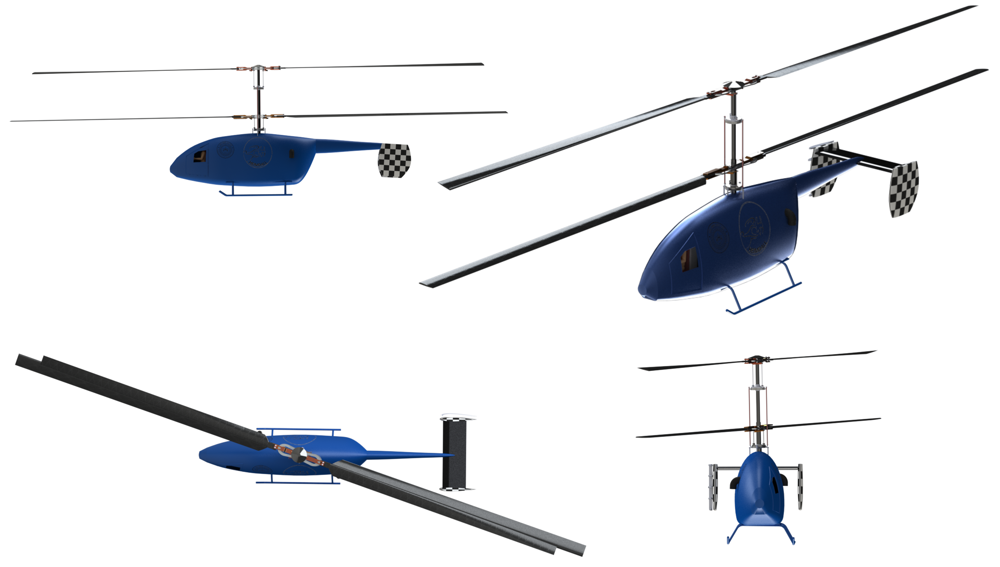

# Sourav Sinha
{:height="180px" width="180px"}
>
> **Current**: Senior Engineer in EDG @ The MathWorks, Inc.  \
> **Previous**: Graduate Research Assistant @ Virginia Tech | Graduate Teaching Assistant @ Virginia Tech | Research Intern @ NYU Tandon School of Engineering

[Google Scholar profile](https://scholar.google.co.in/citations?user=lNqewX0AAAAJ&hl=en&inst=13410158990364976897){:target="_blank" rel="noopener"}  
[ResearchGate profile](https://www.researchgate.net/profile/Sourav-Sinha-8){:target="_blank" rel="noopener"}

## Education
#### Virginia Tech, *Blacksburg, US,* 2019-2024
>
> Ph.D. in Aerospace Engineering \
> GPA: 4.0/4.0 \
> Advisor: [Dr. Mazen Farhood](http://www.dept.aoe.vt.edu/~farhood/Main.html){:target="_blank" rel="noopener"}

####  Indian Institute of Technology (IIT) Kanpur, *Kanpur, India,* 2014-2019
>
> Integrated B.Tech-M.Tech in Aerospace Engineering  \
> GPA: 8.2/10.0 (B.Tech), 9.33/10.0 (M.Tech) \
> Advisors: [Dr. Abhishek](https://home.iitk.ac.in/~abhish/){:target="_blank" rel="noopener"} and [Dr. Mangal Kothari](https://home.iitk.ac.in/~mangal/){:target="_blank" rel="noopener"}

## Technical Skills
#### Programming Languages: 
> MATLAB, Python, C++
#### Miscellaneous:
> Simulink, Github, Jupyter, Google Colab, LaTeX, LabVIEW, Microsoft Office, Pixhawk, Arduino, Raspberry Pi

## Projects

### 1. Neural Network‑based Approximation of Nonlinear Systems in Koopman Form

Description: This work utilizes the Koopman operator theory to approximate nonlinear dynamical systems with bilinear and linear parameter‑varying systems. We develop a recurrent neural network (RNN) architecture using PyTorch to learn the systems and characterize uncertain initial conditions. Neural network weights are parameterized a priori to ensure stable and norm‑bounded system behavior. Robust controllers for nonlinear systems are designed based on learned models.

Publication 1: **S. Sinha** and M. Farhood, ``Robust Control Design and Analysis for Nonlinear Systems with Uncertain Initial Conditions Based on Lifting Linearization," *Submitted*, 2025.

Publication 2: **S. Sinha** and M. Farhood, ``Data-Driven Discrepancy Modeling in Higher-Dimensional State Space via Coprime Factorization," *Submitted*, 2025.

### 2. Robust Control Design for Autonomous Underwater Vehicles (AUVs)

Description: This work provides an integral quadratic constraint-based analysis framework developed for synthesizing and analyzing robust, path-following controllers for AUVs. We apply deep learning techniques with PyTorch to model the hydrodynamics of an AUV using a feedforward neural network. Controllers are tuned using an automated tuning routine that quickly refines an initial controller, yielding one with significantly enhanced robust performance. The controllers are implemented on the AUV platform using C++, and comprehensive underwater experiments are conducted in Claytor Lake, Virginia, USA, to validate the controllers.

Publication 1: **Sourav Sinha**, Mazen Farhood, and Daniel J. Stilwell, ``Control Design and Analysis for Autonomous Underwater Vehicles Using Integral Quadratic Constraint," *Control Engineering Practice*, 2025. [[link]](https://www.sciencedirect.com/science/article/abs/pii/S0967066124003010)

Publication 2: **Sourav Sinha**, Mazen Farhood, and Daniel J. Stilwell, ``Robust Path Following Control of Autonomous Underwater Vehicles via Gain Scheduling and Integral Quadratic Constraints," *IEEE Conference on Decision and Control*, 2024. [[link]](https://ieeexplore-ieee-org.ezproxy.lib.vt.edu/document/10886214)

### 3. Adversarial Attacks on Object Tracking
coming soon

### 4. Critical Attack Points in Cyber-Physical Systems 
coming soon

### 5. Intentional EMI-based Actuator Attacks 

{:height="360px"}

Publication: G.Y. Dayanikli, **S. Sinha**, D. Muniraj, R.M. Gerdes, M. Farhood, and M. Mina,  “Physical-Layer Attacks Against
Pulse Width Modulation-Controlled Actuators,” *USENIX Security Symposium*, 2022. [[link]](https://www.usenix.org/conference/usenixsecurity22/presentation/dayanikli)

### 6. Video Deepfake Detection Using Deep Learning 
coming soon

### 7. LPV/LFT Representation of Nonlinear Systems
Publication: **S. Sinha**, D. Muniraj, and M. Farhood, “LFT Representation of a Class of Nonlinear Systems: A Data-Driven 
Approach,” *European Control Conference*, 2021. [[link]](https://ieeexplore.ieee.org/abstract/document/9655026) 

### 8. Robust Control of UAS 
coming soon

### 9. Development of a Novel Quadrotor Convertiplane UAS
{:height="180px"}

{:height="180px"}  {:height="180px"} 

Publication 1: **S. Sinha**, N. Raj, A. Abhishek, and M. Kothari, “Flight dynamic modeling and control of a novel quadrotor convertiplane
UAV,” *Vertical Flight Society Annual Forum*, 2018. [[link]](https://vtol.org/store/product/flight-dynamic-modeling-and-control-of-a-novel-quadrotor-convertiplane-unmanned-aerial-vehicle-12923.cfm) [[free access]](https://drive.google.com/file/d/1fmOD_L53s9XE-H2bPnjCyeU2oyTmXIJg/view)

Publication 2: A. Abhishek, M. Krishna, **S. Sinha**, J. Bhowmik, and D.  Das, “Design, development and flight testing of a novel 
quadrotor convertiplane unmanned air vehicle,” *Vertical Flight Society Annual Forum*, 2017. [[link]](https://www.researchgate.net/profile/Abhishek-Abhishek/publication/317380270_Design_Development_and_Flight_Testing_of_a_Novel_Quadrotor_Convertiplane_Unmanned_Air_Vehicle/links/5937c39faca272ede1cf7d1f/Design-Development-and-Flight-Testing-of-a-Novel-Quadrotor-Convertiplane-Unmanned-Air-Vehicle.pdf)

### 10. 24-hour Hovering Helicopter, AHS Student Design Competition, 2017
[Report](https://www.researchgate.net/publication/321319875_Conceptual_Design_of_a_24_Hour_Hovering_Helicopter)
{:width="360px"}

### 11. Reconfigurable VTOL Aircraft, AHS Student Design Competition, 2018
[Report](https://drive.google.com/file/d/1re7lg5xXxY8fxJJ30L2hojX8llk2CRYZ/view)
{:width="360px"}

### 12. Preliminary Design of an Aircraft
[Report](https://www.researchgate.net/publication/321107730_Designing_of_an_aircraft_based_on_preliminary_mission_requirement)

## Coursework
>
> Dynamics and Controls
> > Linear Systems Theory, Nonlinear Systems Theory, Vehicle Dynamics and Control, Linear Control Theory
> > Autonomous Navigation, Control System Analysis, Convex Optimization

> Machine Learning
> > Deep Learning, Computer Vision

> Aircraft
> > Aircraft Design, Helicopter Theory, Preliminary Design of Helicopter, Autononmous Unmanned Aerial Systems, Aeromodel Design and Fabrication, Flight Mechanics

## Contact
[Email](mailto:srvsinha@vt.edu){:target="_blank" rel="noopener"} | [Linkedin](https://www.linkedin.com/in/sourav-sinha-7a8380b8/){:target="_blank" rel="noopener"} | [Instagram](https://www.instagram.com/srvsinha186/){:target="_blank" rel="noopener"} | [Facebook](https://www.facebook.com/srvgr8/){:target="_blank" rel="noopener"}
